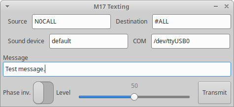
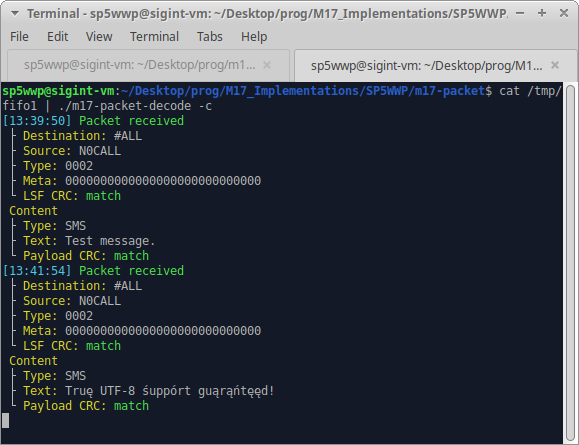

# m17-texting

### Overview
A simple C GUI app, generating M17 baseband of its packet mode. Works well with the [Digirig Mobile](https://github.com/softcomplex/Digirig-Mobile) (and a Yeasu FTM-6000).

### Building
Run `make` in the main directory.

#### Prerequisites
All the GTK3 stuff, [libm17](https://github.com/M17-Project/libm17), [libao](https://github.com/xiph/libao).

### Running
Run `./m17-texting`.

### Decoding
M17 packets can be decoded with the `m17-packet-decoder` available in the [M17_Implementations](https://github.com/M17-Project/M17_Implementations) repository.

Example decode:

